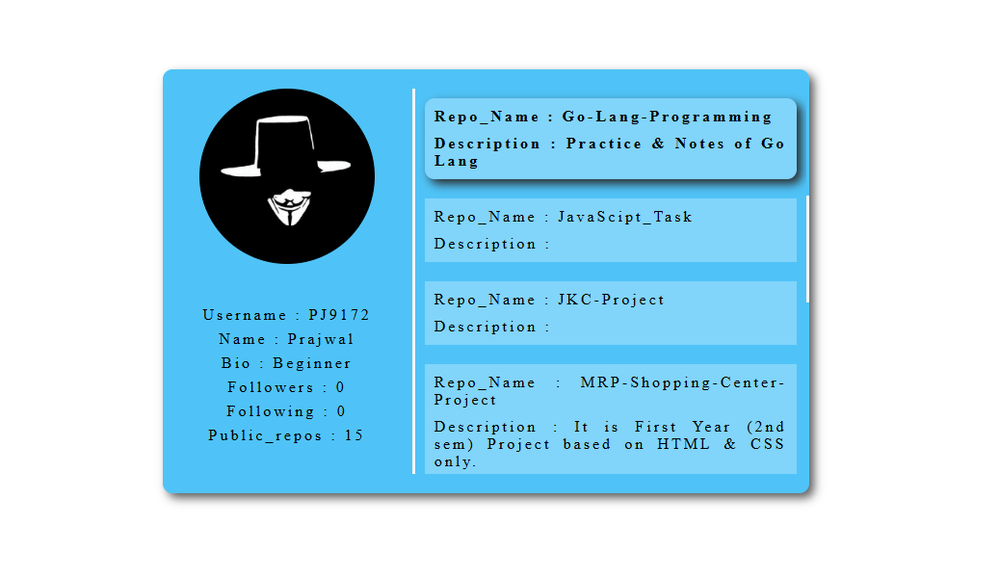

# GitHub-Project

This project is a GitHub user finder web application where users can enter a GitHub username, and the server fetches the user's data from the GitHub API and displays it in a formatted manner on a separate results page.

## Project Structure

- **index.html**: The landing page where users can input the GitHub username.
- **user.html**: The results page where the fetched GitHub user data is displayed.
- **main.go**: The backend Go server that fetches data from the GitHub API and forwards the data to `user.html` for proper display.


## Getting Started

### Prerequisites

- [Go](https://golang.org/) installed on your machine.
- Basic understanding of Go and HTML.

### Installation

1. Clone the repository :
   ```bash
   git clone https://github.com/PJ9172/GitHub-Project.git
   ```
2. Navigate to the project directory :
    ```bash
    cd GitHub-Project
    ```
### Running The Project

1. Run the Go Server : 
    ```bash
    go run main.go
    ```
2. Open your browser and navigate to `http://localhost:3000/` to access the main page.

3. If your `port:3000` is busy then change it according to your availability. Change the code in `main.go` & run it again.
   ```go
   err := http.ListenAndServe(":your_available_port", nil)
   ```
### Screenshots

- Landing Page : 

   

- User Info Page : 

   